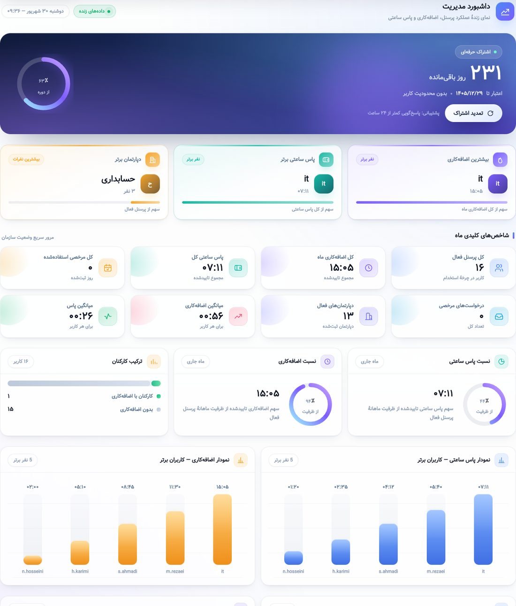
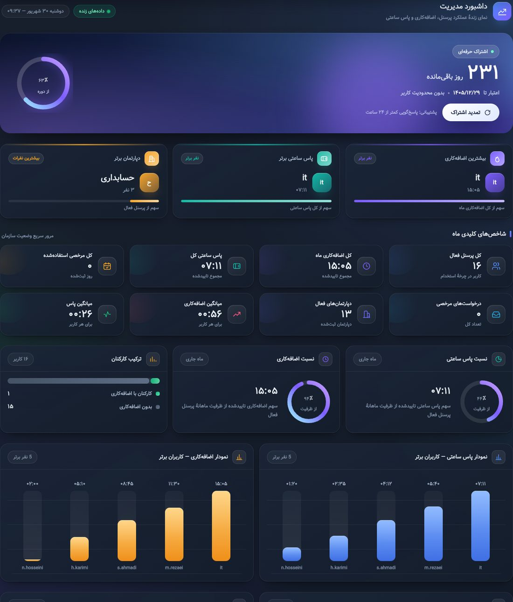

# داشبورد مدیریت — سیستم طراحی مدرن (۱۴۰۵)

بازطراحی کامل باکس داشبورد پنل مدیریت (`#dashboardBox`) بر پایهٔ جدیدترین
متدهای طراحی روز دنیا: سطوح شیشه‌ای، گرادیان‌های نرم، حرکت‌های معنادار و
سلسله‌مراتب بصری روشن.




---

## ۱) معماری لایه‌ها

| فایل | نقش |
| --- | --- |
| `app/static/css/dashboard-modern.css` | تمام ظاهر داشبورد (توکن‌ها، چیدمان، کارت‌ها، نمودار، جدول، حرکت، ریسپانسیو، چاپ) |
| `app/static/js/dashboard-modern.js` | شمارش اعداد، رشد میله‌ها/حلقه‌ها/نوارها، ورود پله‌ای، هالهٔ نشانگر، ساعت سربرگ |
| `app/static/css/dark-theme.css` | فقط نسخهٔ تیرهٔ همان توکن‌ها و سطوح جدید (طبق قاعدهٔ AGENTS.md) |
| `app/templates/admin.html` | مارک‌آپ سمانتیک داشبورد (hx-*) + بارگذاری دو فایل بالا |

`dashboard-modern.css` **قبل از** `dark-theme.css` لود می‌شود تا لایهٔ تیره
همیشه اولویت آخر را داشته باشد؛ و **بعد از** `admin.css` تا ظاهر کارتی قدیمی
داشبورد را کامل بازنویسی کند.

> هیچ قاعدهٔ ظاهری قدیمی داشبورد (`.dashboard-grid`، `.dashboard-card--highlight`،
> `.dashboard-chart-row`، `.bar-value.overtime`…) در `admin.css` باقی نمانده است.
> فقط کلاس‌های بنیادی سازگاری (`.dashboard-card`، `.dashboard-chart-card`،
> `.dashboard-table-card`، `.dashboard-quick-card`، `.dashboard-table`،
> `.card-title/.card-value/.card-meta`، `.bar-*`) نگه داشته شده‌اند تا سوئیت‌های
> پوشش تم تیره و جدول‌های واکنش‌گرا سبز بمانند؛ این کلاس‌ها در مارک‌آپ جدید هم
> استفاده می‌شوند.

---

## ۲) ساختار صفحه (RTL)

```
#dashboardBox.hx-dashboard
└── .hx-dash
    ├── .hx-head            سربرگ: عنوان + نشان «داده‌های زنده» + ساعت زندهٔ شمسی
    ├── .hx-hero            کارت قهرمان اشتراک + حلقهٔ ۶۳٪ + دکمهٔ تمدید
    ├── .hx-spot-row        ۳ کارت ستاره (اضافه‌کاری، پاس، دپارتمان) + نوار سهم
    ├── .hx-kpis            ۸ شاخص کلیدی با کاشی آیکون رنگی
    ├── .hx-insights        ۳ کارت تحلیلی: گیج نسبت پاس، گیج نسبت اضافه‌کاری، ترکیب کارکنان
    ├── .hx-charts          ۲ نمودار ستونی کاربران برتر
    └── .hx-tables          ۲ جدول لیدربورد با نشان رتبه
```

---

## ۳) توکن‌های طراحی

```css
/* رنگ معنایی */
--hx-blue  --hx-violet  --hx-teal  --hx-amber
--hx-cyan  --hx-indigo  --hx-rose  --hx-green  --hx-slate

/* سطوح و متن */
--hx-ink / --hx-ink-2 / --hx-ink-3
--hx-surface / --hx-surface-strong / --hx-surface-soft
--hx-border / --hx-border-strong

/* فرم */
--hx-radius-xl: 26px   --hx-radius-lg: 20px   --hx-radius-md: 15px
--hx-shadow-xs … --hx-shadow-lg   (سایه‌های چندلایه)

/* حرکت */
--hx-ease       cubic-bezier(.22,1,.36,1)      (نرم و سریع — برای ورود کارت‌ها)
--hx-ease-spring cubic-bezier(.34,1.56,.64,1)  (فنری — برای آیکون‌ها)
--hx-ease-soft  cubic-bezier(.4,0,.2,1)        (مناسب هاور)
```

هر رنگ اکسنت روی هر کارت با `data-accent="…"` انتخاب می‌شود
(`--acc`, `--hx-halo`) و بقیهٔ اجزا با `color-mix()` از آن مشتق می‌شوند؛ بنابراین
افزودن رنگ تازه فقط یک خط CSS است.

### حالت تیره
همهٔ توکن‌ها در `dark-theme.css` زیر `body.dark-mode #dashboardBox.hx-dashboard`
بازتعریف شده‌اند؛ هیچ رنگ تیره‌ای در فایل روشن وجود ندارد (تست دارد).

---

## ۴) حرکت (Motion)

| حرکت | جزئیات | کاهش حرکت |
| --- | --- | --- |
| ورود پله‌ای | `.hx-reveal` با `--hx-i` (تأخیر ۵۵ms × اندیس) | مستقیم نمایش داده می‌شود |
| شمارش اعداد | `data-hx-count` — ارقام فارسی و جداکننده‌ها حفظ می‌شوند (`۱۵:۰۵`, `۱۴۰۵/۱۲/۲۹`) | مقدار نهایی |
| رشد میله‌ها | `data-percent` → متغیر `--hx-h` با تأخیر پله‌ای ۷۰ms | ارتفاع نهایی |
| حلقه‌های پیشرفت | `data-hx-ring` → `stroke-dashoffset` (۱٫۶s) | مقدار نهایی |
| نوار سهم/توزیع | `data-hx-share` / `data-hx-split` (سهم زمانی «۱۵:۰۵» دقیق محاسبه می‌شود) | مقدار نهایی |
| هالهٔ متحرک قهرمان | سه لکهٔ بلور با `hx-aurora-drift` (۱۸s) | متوقف |
| درخشش عبوری | برق یک‌بارهٔ `hx-sheen` روی کارت قهرمان | متوقف |
| هالهٔ نشانگر | `--hx-mx/--hx-my` روی `.hx-kpi/.hx-spot/.hx-card` (فقط دستگاه‌های اشاره‌گر) | خاموش |

همهٔ موارد بالا زیر `@media (prefers-reduced-motion: reduce)` خاموش می‌شوند و
بدون اجرای JS هم مقدارهای نهایی در HTML رندر شده‌اند (شمارنده‌ها فقط پاراگراف
تزئینی‌اند، نه منبع داده).

---

## ۵) سازگاری رفتاری

* `display` باکس هرگز در CSS ست نمی‌شود؛ منطق `toggleBox()` (پنهان/نمایش با
  `style.display`) دست‌نخورده کار می‌کند. باکس در جریان عادی صفحه است و
  اسکرول داخلی/`position: sticky` قبلی حذف شده تا تمام داشبورد با اسکرول صفحه
  دیده شود.
* عرض باکس با حاشیهٔ منطقی (`margin-inline-start: calc(clamp(64px,6vw,78px)+1.15rem)`)
  تنظیم می‌شود تا در همهٔ عرض‌ها با سایدبار و مسیر اسکرول هم‌راستا باشد و
  هیچ‌گاه سرریز افقی (overflow-x) نسازد.
* جدول‌های داشبورد در `responsive-tables.js` ثبت‌اند (الگوی `keep`)؛ ساختار
  `<table>`, `thead`, `tbody` تغییر نکرده و لایهٔ موبایل/چاپ دست‌نخورده است.
* کارت قهرمان همچنان «اشتراک حرفه‌ای» را نمایش می‌دهد، اما دکمهٔ تمدید واقعاً
  پنل اشتراک موجود را باز می‌کند (`data-panel="subscription"`) و مقادیر روز/تاریخ
  از سمت سرور (`subscription_*` در `app/main.py`) می‌آیند تا با پروفایل هم‌خوان
  بمانند.
* در حالت خالی (بدون داده) به‌جای نمودار/جدول خالی، حالت `hx-empty` با پیام
  فارسی نمایش داده می‌شود.

---

## ۶) تست‌ها

```bash
# ایستا (CSS/قالب/قرارداد قلاب‌ها)
python -m pytest tests/test_dashboard_modern.py

# رفتاری (jsdom) — نیازمند Node
cd tests/js && npm install jsdom
cd ../.. && python -m pytest tests/test_dashboard_modern_dom.py
```

`tests/test_dashboard_modern.py` این موارد را تضمین می‌کند: بارگذاری درست لایه‌ها،
حذف قواعد ظاهری قدیمی، نبود `display` روی باکس، باقی‌ماندن همهٔ متغیرهای سمت سرور،
پوشش کامل تم تیره، احترام به `prefers-reduced-motion` و هم‌خوانی قلاب‌های `data-hx-*`
بین قالب و JS.

---

## ۷) پیش‌نمایش آفلاین (بدون SQL Server)

برای دیدن نتیجه بدون دیتابیس، قالب با دادهٔ نمونه رندر می‌شود:

```bash
python preview/render.py
python -m http.server 5000 --directory preview/out        # دادهٔ نمونه
python -m http.server 5010 --directory preview/out-empty  # حالت خالی
```
